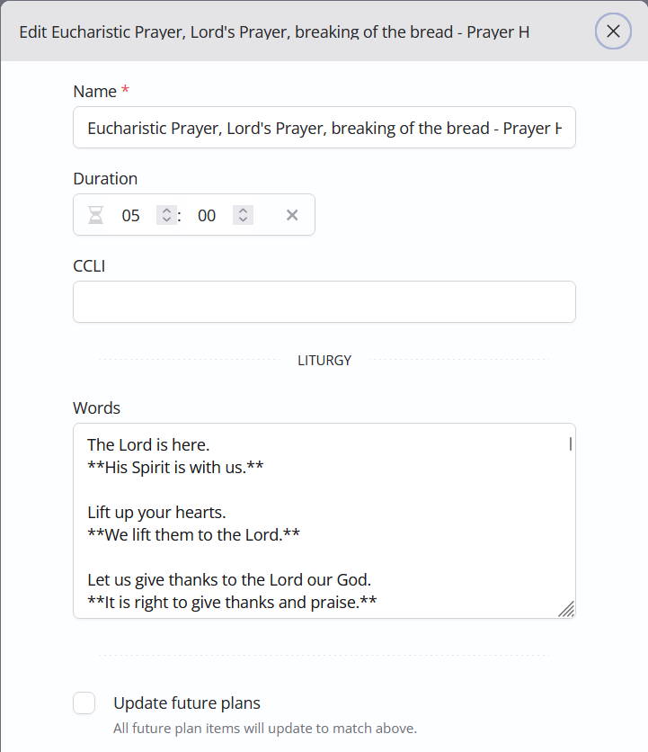
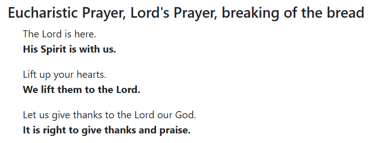
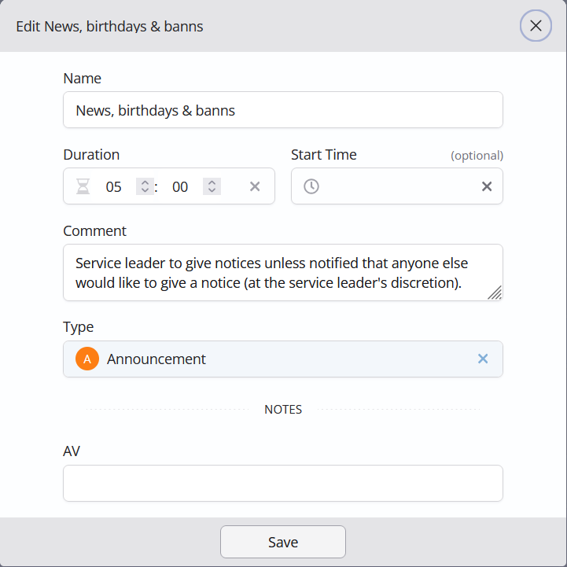
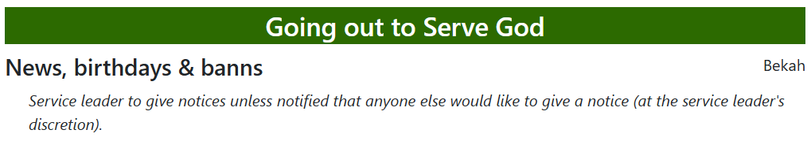
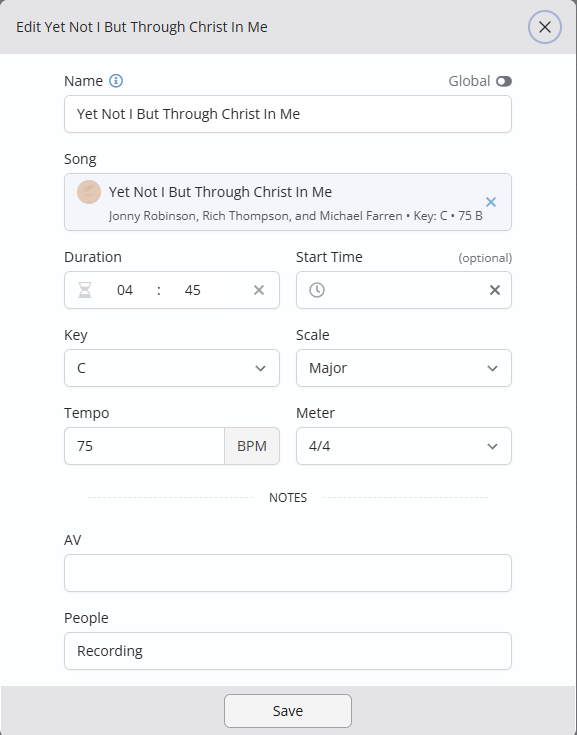

## ChurchSuite tips

A few quick tips on setting up your service plans in ChurchSuite to work optimally with
this program's out-of-the-box templates.

### Headings

We have found it useful to be able to insert section headings within plans. For this, I created
a "heading" plan item type within ChurchSuite (under **Planning** > **Types**). So long as you
call yours "heading", it will be picked up automatically by the default templates.

For example, if you are belong to the Church of England you could insert heading items for
"The Gathering", "The Liturgy of the Word", "The Liturgy of the Sacrament" and "The Dismissal".

### Liturgy formatting

The provided "Full Service Order" template will let you add formatted text to "Liturgy" and
"Prayer" service items, using [CommonMark](https://commonmark.org/help/) syntax. This provides
most of what is needed to be able to format liturgical text.

For example, here is part of a library item in our ChurchSuite account:

and this is how it appears in the printed plan:

### Comments and notes

In the out-of-the-box "Full Service Order" template, any text added in the **Comment** field of a plan item will
be shown in italics in the plan. For example, this plan item:

will be shown in the printed plan like this:

If you have a plan item note category named "People", any note of that type will be shown by the
out-of-the-box templates after the names of the people assigned to a plan item. (We find this useful,
for example, on occasions when we need to show the use of recorded music rather than live musicians.)

For example, this plan item:

would be shown by the "Outline Running Order" template like this:

Display of other types of plan item note is an obvious enhancement for the future, but is not yet supported.

### Song lyrics

Unfortunately the ChurchSuite API does not yet support retrieval of song lyrics - this is an
obvious thing to add to this program, once that enhancement is possible.