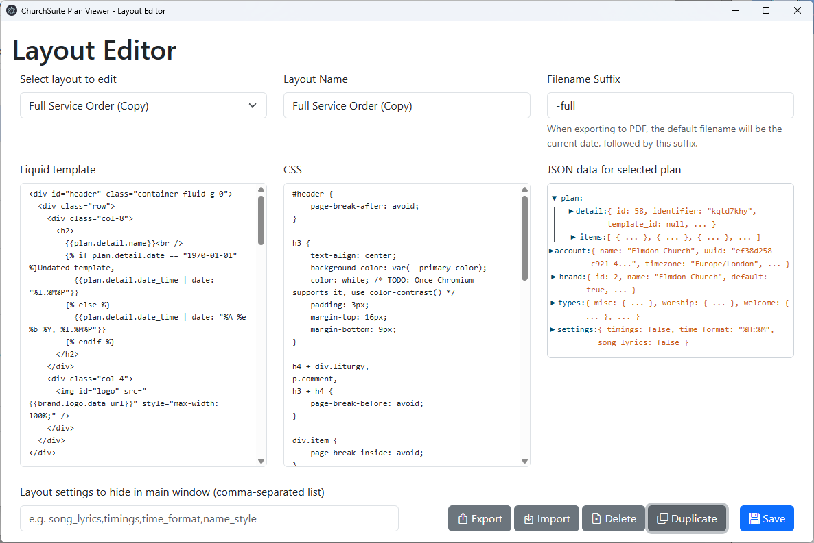

# Template editor
The template editor within ChurchSuite Plan Viewer will let you customise the provided templates, and create your
own. It is opened by clicking the pencil button next to the **Select a template** drop-down in the main window.

The window is divided into three sections:
* At the top, you select a template to edit, and edit its name and settings.
* In the middle, you control how the template displays your service plan.
* At the bottom are controls to save the current template and to duplicate, export, import and delete templates.