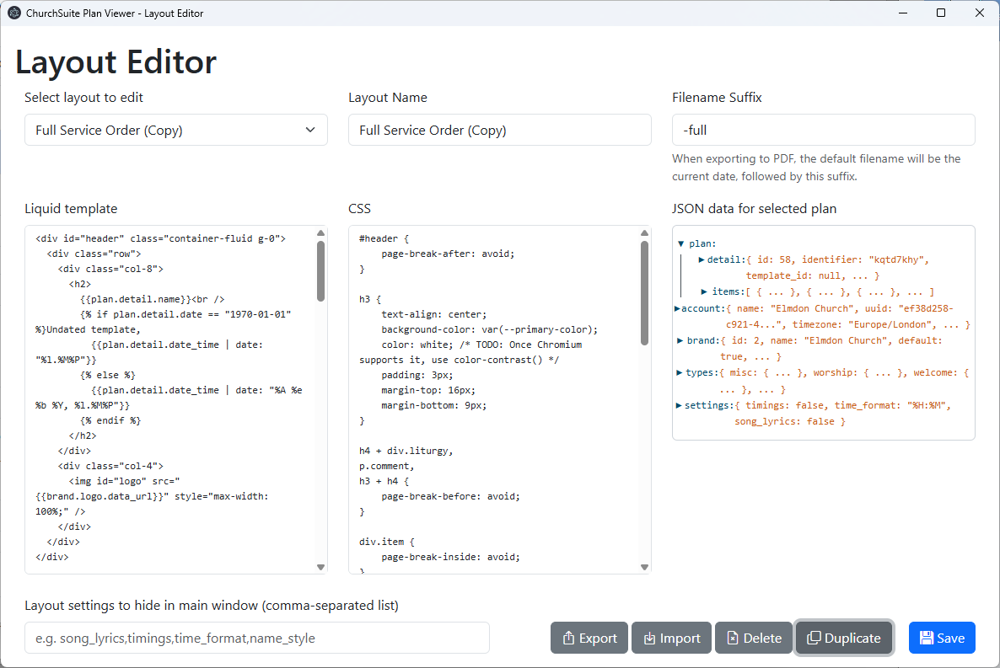

## Layout editor

The layout editor within ChurchSuite Plan Viewer will let you customise the provided layouts, and create your
own. It is opened by clicking the pencil button next to the **Select a layout** drop-down in the main window.

If you are lucky enough to have dual monitors on your computer, you may find it convenient to put one window on
each monitor!

### Overview

The layout editor window is divided into three sections:

* At the top, you select a layout to edit, and edit its name and settings. The **Filename suffix** is used
  when the program suggests a name for the exported PDF file - for example, the "Full Service Order" layout
  uses a suffix of "-full", so suggesting filenames like `02-11-2025-1100-full.pdf`.
* In the middle, you control how the layout displays your service plan - see below.
* Bottom left is a field which allows you to hide certain layout settings which do not make sense with
  a particular layout.
* And at the bottom right are controls to save the current layout and to duplicate, export, import and delete layouts.

*The default layouts are not editable.* So, to get started, pick a layout you want to start customising, and
click **Duplicate**.

### Liquid template, CSS and JSON data

The middle portion of the layout editor window shows three things:

* The template, written in the [Liquid template language](https://liquidjs.com/tags/overview.html), which
  processes your plan's data to create an HTML web page.
* A CSS stylesheet which is applied to the HTML.
* JSON data representing the selected plan.

Only the first two of these are editable within the layout editor. It is the combination of all three that
creates the printable plan.

### JSON data

Use the right hand section to explore the data available to your layout, clicking the triangle icons to
expand and collapse different sections. Most of this data is structured according to ChurchSuite's
[Planning module API models](https://developer.churchsuite.com/planning#models).

There are three top-level objects:

* `plan`, representing the chosen service plan or plan template. Within this are two further objects:
  * `plan.detail` contains the overall plan properties. When viewing dated plans, it is a
    [Plan model](https://developer.churchsuite.com/planning#model/plan) with one addition, the `date_time`
    property which represents the plan's start date and time as a JavaScript Date object.
    When viewing a plan template, it is a [Template model](https://developer.churchsuite.com/planning#model/Template)
  * `plan.items` is an array of objects, each representing an item in the service plan.
    When viewing dated plans, each item is a [PlanItem model](https://developer.churchsuite.com/planning#model/planitem)
    with one addition, the `date_time` property which represents the plan item's start date and time as a JavaScript Date object.
    When viewing plan templates, each item is a [TemplateItem model](https://developer.churchsuite.com/planning#model/TemplateItem)
  * If **Show song lyrics** is selected, and a service item represents a song, the item will additionally have an `arrangement` property
    which is a [SongArrangement model](https://developer.churchsuite.com/planning#model/songarrangement), and a `song` property which
    is a [Song model](https://developer.churchsuite.com/planning#model/song). The `arrangement` property is in turn augmented with a
    `stanzas` property which is an array of objects, each representing a stanza of the song chart. Each stanza has a `name` property
    (e.g. `Verse 1`, and an array of strings representing the lines of that stanza.)
* `account` represents key details from your church's account as an [Account model](https://developer.churchsuite.com/account#model/Account).
  minus the `billing_address`, `billing_contact`, `data_protection_contact` and `account_contact properties`
* `brand` represents your account's default branding as a [Brand model](https://developer.churchsuite.com/account#model/brand),
  allowing you to display your logo and use the default brand colour. In addition, a `logo.data_url` property is added giving your
  logo as a data: URL for easier display within your layout.
* `types` contains a set of properties each representing one of your plan item types as
  [Type model](https://developer.churchsuite.com/planning#model/type), and with the key being the type name converted
  to lower case with spaces changed to underscores. This can be used by your layout to display the different item types
  in appropriate ways - there are examples of this in the default layouts.

### The plan pane

When your Liquid template has been applied to the plan data, it is loaded into the right hand pane of the
main plan viewer window.

This pane has the [Bootstrap 5.3](https://getbootstrap.com/docs/5.3/getting-started/introduction/) styles applied,
including their sans-serif native font stack. Your layout's own styles are also loaded, using CSS nesting so that they only
apply to the HTML code generated by your Liquid template. Within your CSS you can use the `--primary-color` variable
to reference your ChurchSuite account's primary colour.

### Liquid filters

In addition to the standard LiquidJS [tags](https://liquidjs.com/tags/overview.html) and
[filters](https://liquidjs.com/filters/overview.html), the following additional filters can be used

* `bibleBook`, which converts the abbreviations ChurchSuite uses into a more recognisable name of a book of the Bible.
* `markdown`, which converts Markdown text (using the [CommonMark specification](https://spec.commonmark.org/0.31.2/)) to HTML
* `personName`, which takes a person and formats their name according to the user's chosen **Default name style** setting.
* `songKey`, which takes a song item and displays the song's key.
* `songCredits`, which takes a song item and displays its copyright information, including your CCLI Licence number if configured
  in the global settings.

Examples of using all of these can be found in the default layouts.

### Importing and exporting layouts

The **Export** and **Import** buttons do exactly what you expect, saving layouts as a `.planlayout` file that you
can share with others.
