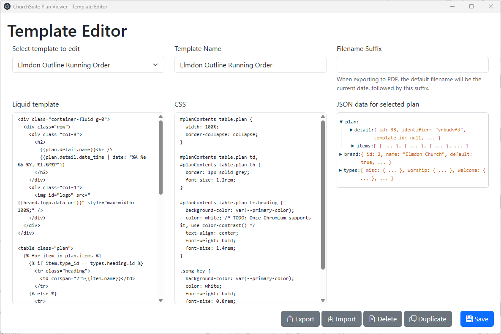

# Template editor
The template editor within ChurchSuite Plan Viewer will let you customise the provided templates, and create your
own. It is opened by clicking the pencil button next to the **Select a template** drop-down in the main window.

If you are lucky enough to have dual monitors on your computer, you may find it convenient to put one window on
each monitor!

## Overview
The template editor window is divided into three sections:
* At the top, you select a template to edit, and edit its name and settings. The **Filename suffix** is used
  when the program suggests a name for the exported PDF file - for example, the "Full Service Order" template
  uses a suffix of "-full", so suggesting filenames like `02-11-2025-1100-full.pdf`.
* In the middle, you control how the template displays your service plan - see below.
* At the bottom are controls to save the current template and to duplicate, export, import and delete templates.

*The default templates are not editable.* So, to get started, pick a template you want to start customising, and
click **Duplicate**.

## Liquid template, CSS and JSON data
The middle portion of the template editor window shows three things:
* The template, written in the [Liquid template language](https://liquidjs.com/tags/overview.html), which
  processes your plan's data to create an HTML web page.
* A CSS stylesheet which is applied to the template.
* JSON data representing the selected plan.

Only the first two of these are editable within the template editor. It is the combination of all three that
creates the printable plan.

## JSON data
Use the right hand section to explore the data available to your template, clicking the triangle icons to
expand and collapse different sections.

There are three top-level objects:
* `plan`, representing the chosen service plan. Within this are two further objects:
  * `plan.detail` contains the overall plan properties.
  * `plan.items` is an array of objects, each representing an item in the service plan.
* `brand` represents your account's default branding, allowing you to display your logo and use the default
  brand colour.
* `types` is an array of objects, each representing one of your plan item types. This can be used by your
  template to display the different item types in appropriate ways - there are examples of this in the default
  templates.

## The #planContent pane
When your Liquid template has been applied to the plan data, it is loaded into the right hand pane of the
main plan viewer window, where it is inserted into a `
` element.

This pane has the [Bootstrap 5.3](https://getbootstrap.com/docs/5.3/getting-started/introduction/) styles applied,
including their sans-serif native font stack. Your template's own styles are also loaded.

## Liquid filters
In addition to the [standard LiquidJS filters](https://liquidjs.com/filters/overview.html), the following
additional filters can be used

* `bibleBook`, which converts the abbreviations ChurchSuite uses into a more recognisable name of a book of the Bible.
* `markdown`, which converts Markdown text (using the [CommonMark specification](https://spec.commonmark.org/0.31.2/)) to HTML
* `personName`, which takes a person and formats their name according to the user's chosen **Default name style** setting.
* `songKey`, which takes a song item and displays the song's key.

Examples of using all of these can be found in the default templates.

## Importing and exporting templates
The **Export** and **Import** buttons do exactly what you expect, saving templates as a `.plantemplate` file that you
can share with others.