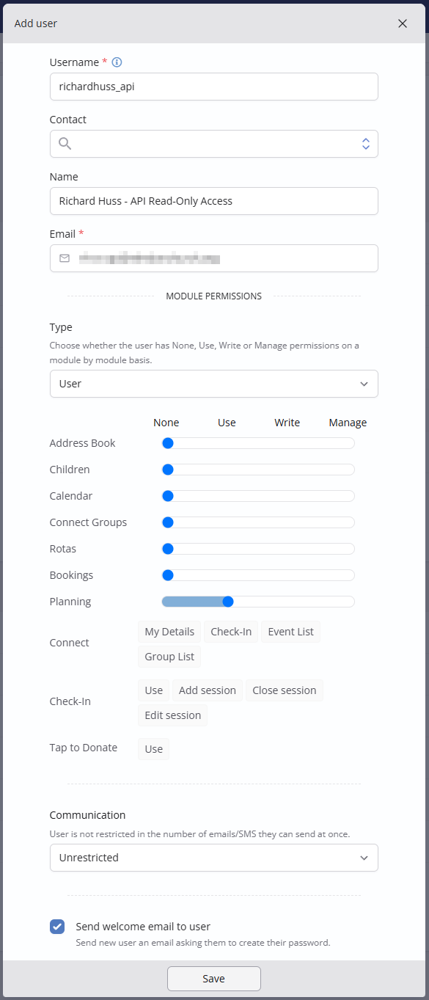
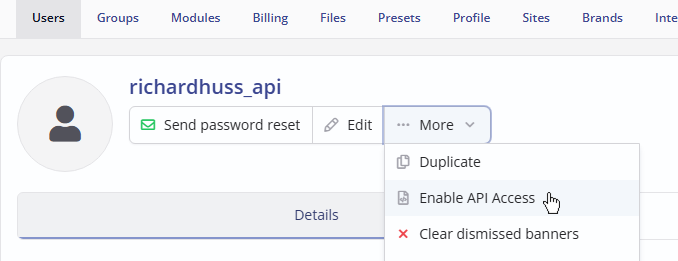
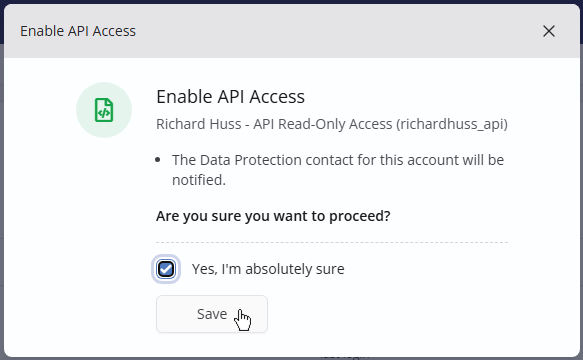
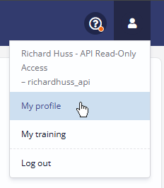
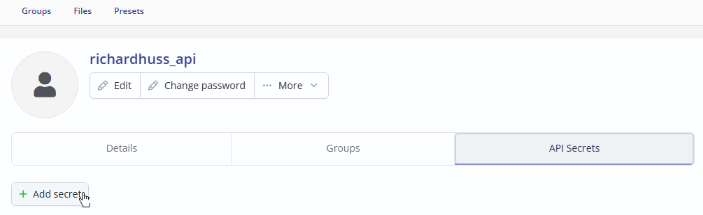
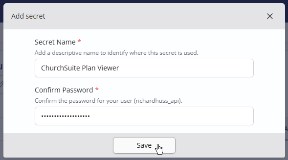
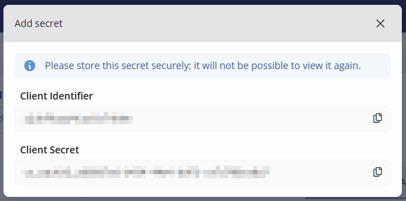
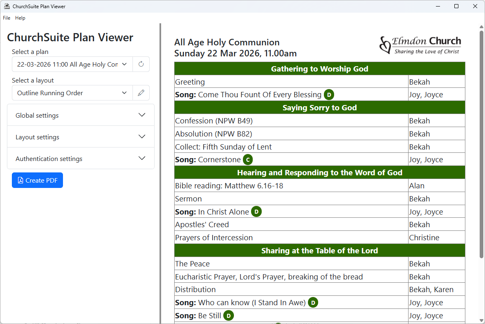

## Installation and Setup

This guide will help you set up and configure the ChurchSuite Plan Viewer application.

### Setting up access

Before you can use ChurchSuite Plan Viewer, you will need to set up a user account in ChurchSuite and grant "API access".
To do this, first log into ChurchSuite as a user with administator privileges, click on your profile top right, and go to
**Settings**, then **Users**.

Click **Add User** and set up the new user account. I recommend you use the same username as your regular account, with `_api`
added at the end. Give user a name that clearly indicates its purpose. Under **Module Permissions**, give **Use** access
to the Planning module - no other permissions are required.

Once you have saved the new user, click ... More and choose **Enable API Access**.

Now log out, and log in as your newly created user.

Click on your profile top right, and choose **My profile**.

Click into the **Secrets** tab which will now be visible, and click **Add secret**.

Enter a name (I used **ChurchSuite Plan Viewer**) and confirm your password.

Your new API secret will be shown - it will not be possible to view it again once you have closed the dialog. Easiest to keep it on the screen
until you have installed and run the program.

### Installing the program

Now you can download and install ChurchSuite Plan Viewer from the [releases page](https://github.com/hussra/churchsuite-plan-viewer/releases).

When it first runs, it will show a **Log in** button at the top of the left panel. Click it to sign in to ChurchSuite using the built-in OAuth flow. The app uses the PKCE authorisation code flow and opens a local loopback callback listener at `http://127.0.0.1:35724/callback` to receive the redirect from ChurchSuite.

Once successfully signed in, the left pane will show a welcome message and a **Log out** button, and you will then see the plan and layout controls, with the selected plan preview on the right.

