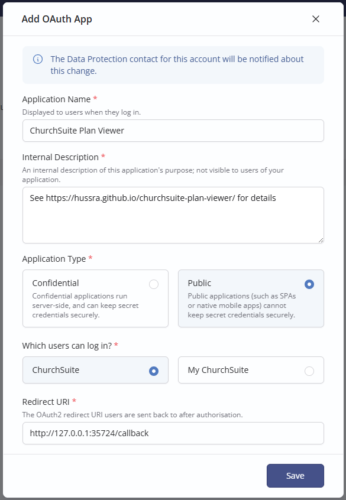
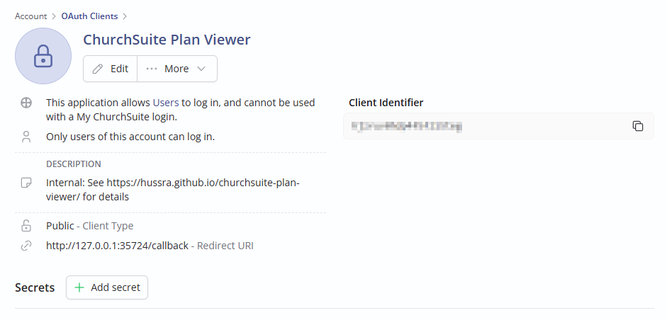
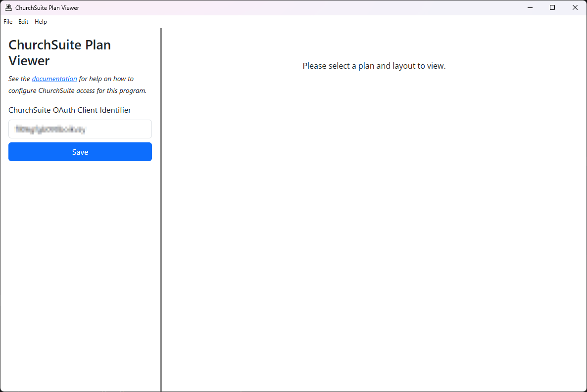
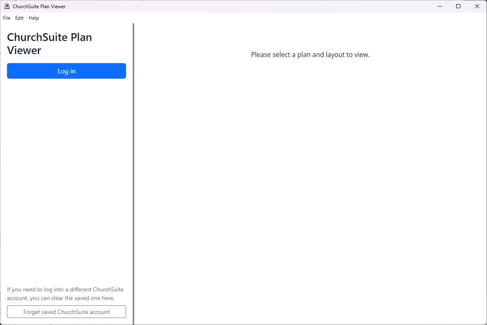
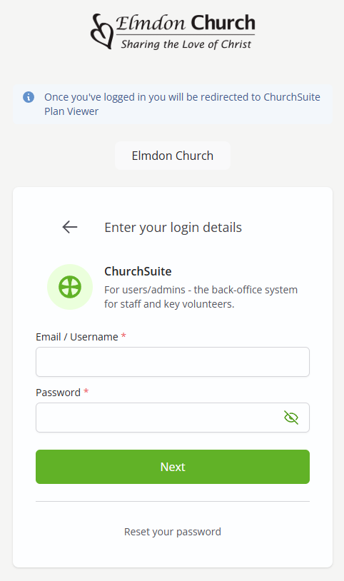
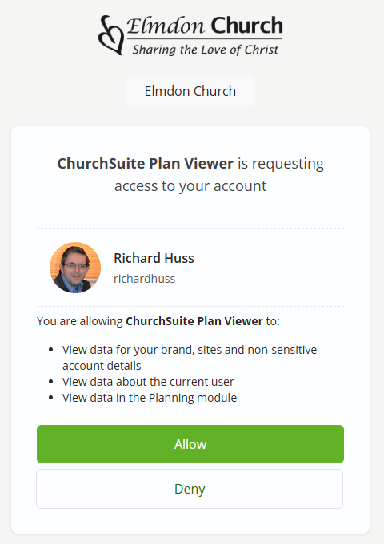
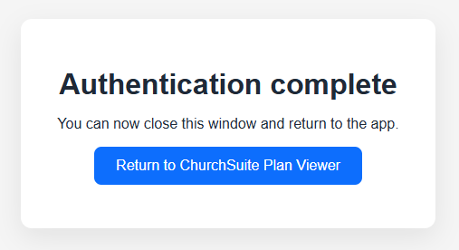

## Installation and Setup

This guide will help you set up and configure the ChurchSuite Plan Viewer application.

The way you set this up changed extensively in version 1.6 - there are [separate instructions for v1.5 and earlier](setup-pre1.6.html).

### Setting up access

Before you can use ChurchSuite Plan Viewer, you will need to set up an OAuth App in ChurchSuite and note its "Client ID".
To do this, first log into ChurchSuite as a user with administator privileges, and go to to **Account**, then **OAuth Apps**.

Click **Add OAuth App**.

In the Add OAuth App dialog, enter:

- **Application Name**: ChurchSuite Plan Viewer
- **Internal Description**: See https://hussra.github.io/churchsuite-plan-viewer/ for details
- **Application Type**: Public
- **Which users can log in?**: ChurchSuite
- **Redirect URI**: http://127.0.0.1:35724/callback

Click **Save**.

You will end up on this screen:

The Client Identifier is a random string generated by ChurchSuite. Note this - you, and anyone else using the program with
your ChurchSuite account, will need it to continue setup. You can use the **Copy** button next to the Client Identifier.

### Installing and configuring the program

Now you can download and install ChurchSuite Plan Viewer from the [releases page](https://github.com/hussra/churchsuite-plan-viewer/releases).

When it first runs, it will ask for your ChurchSuite OAuth Client Identifier:

Enter the Client Identifier you copied from the first step, and click **Save**.

### Logging in

Once you have saved the Client Identifier, you will be presented with a **Log in** button:

Click **Log in** and your browser will open, inviting you to log in to ChurchSuite:

Log in to ChurchSuite, including two-factor authentication if you have set up that up. Once logged in, you will see this page:

Click **Allow** so that ChurchSuite Plan Viewer can access the required data.

You will see this screen:

You are now logged in to ChurchSuite Plan Viewer, and can switch back to its window and close this browser tab.
