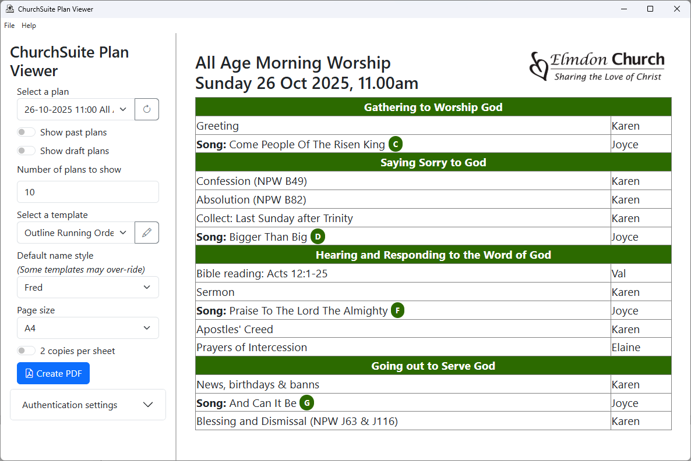
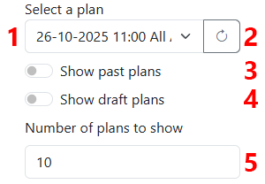
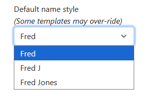

## Using the program

Once the program is [installed and set up](setup.md), usage is straightforward.

You will create and edit your service plans within ChurchSuite itself as usual. ChurchSuite Plan Viewer steps in
once you have a plan in ChurchSuite, and are ready to print it.

The main window of the program is divided into two areas.

* On the left are key settings to help you to:
  * select a plan
  * select a "template" that will be used to display the plan - different templates will show different
    subsets of the information from ChurchSuite
  * configure aspects of how the plan will be formatted and save it as a PDF file.
* On the right, you will see a preview of the selected plan, using the template you have chosen

### Selecting a plan

The first set of controls will help you to find and select the plan you want to work with.

By default, the **Select a plan** drop-down (1 in the screenshot above) will let you choose
from among the next (up to) 10 upcoming published plans.

Next to it is the **Refresh** button (2 in the screenshot) which will reload the list of
plans from ChurchSuite, and reload the selected plan, picking up any changes you have made
within ChurchSuite.

You can change which plans are shown using other controls which are accessed by clicking on
the **Global settings** heading (3 in the screenshot), with the following additional options becoming available:

* **Show past plans** (4)
* **Include draft plans** (5), and
* **Number of plans to show** (6).

### Selecting a template

The next important control is the **Select a template** drop-down.

The **Select a template** drop-down (7 in the screenshot above) will let you choose a template
to view your service plan. ChurchSuite Plan Viewer comes with three templates out-of-the-box:

* **Outline Running Order** simply displays the name of each item in your plan, and the people associated with it
* **Full Service Order** displays much fuller details of your plan, including the text of any liturgy and prayers.
* **Song Lyrics** displays the lyrics of each song in your plan, and is intended to be useful for any church members
  who find it difficult to read these off projector screens.

Next to the drop-down, the **Edit templates** button (8 in the screenhot) launches the [template editor](editor.md).

### Additional options

Within the **Template Settings** section are some further options to refine the program's output.

The **Default name style** drop-down lets you choose how you would like names to be displayed next to service items:

The **Show song lyrics** option does not apply to all templates - it would not make sense to include this with the
**Outline Running Order** template, for example.

And the **show timings** option, likewise, does not apply to all templates - it would not make sense to include this
with the **Song Lyrics** template.

You can choose the base font size, the output page size, select whether you would like two copies per sheet (we use this to create
A5 orders of service using the "outline running order" template), and whether page numbers should be included.

Then click the **Create PDF** button to save and open a PDF file showing the selected service, using your chosen template and other options.

